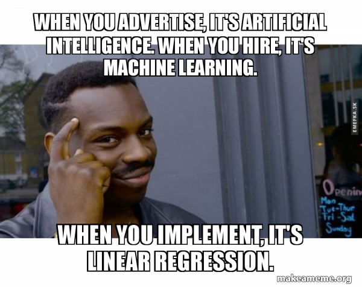

```{r setup, include=FALSE}
knitr::opts_chunk$set(echo = TRUE, warning = FALSE, message = FALSE, 
                      fig.width = 10, fig.height = 10)
```


## Lab: Linear Regression

- Supervised learning (target)

- OLS (Ordinary Least Squares)

- Simple, yet extremely useful and easy to explain



## Libraries

The `library()` function is used to load *libraries*, or groups of  functions and data sets that are not included in the base `R` distribution. Basic functions that perform least squares linear regression and other simple analyses
come standard with the base distribution,  but more exotic functions require additional libraries.
 Here we load the `MASS` package, which is a very large collection of data sets and functions. We  also load the `ISLR2` package, which includes the data sets associated with this book.

Comment: Due to the recent controversies related to the `housing` dataset, we'll use an alternate [housing dataset](https://www.kaggle.com/anthonypino/melbourne-housing-market/code)

```{r chunk1}
# library(MASS)
library(ISLR2)
library(dplyr)
```


If you receive an error message when loading any of these libraries, it
likely indicates that the corresponding library has not yet been
installed on your system. Some libraries, such as `MASS`, come with `R`
and do not need to be separately installed on your computer. However,
other packages, such as `ISLR2`, must be downloaded the first time they
are used. This can be done directly from within `R`. For example, on a
Windows system,  select the `Install package` option
under the `Packages` tab.  After you select any mirror site, a
list of available packages will appear. Simply select the package you
wish to install and `R` will automatically download the
package. Alternatively, this can be done at the `R` command line
via `install.packages("ISLR2")`. This installation only needs
to be done the first time you use a package. However, the
`library()` function must be called within each `R` session.

## Simple Linear Regression

Melbourne Housing Market Kaggle Dataset

The dataset we'll be using for the ISLR2 lab exercises is a subset, clean dataset from the original.

*Features:*

`price`: Price in Australian dollars

`type`: h - house, cottage, villa, semi, terrace; u - unit, duplex; t - townhouse

`method`: S - property sold; SP - property sold prior; PI - property passed in; VB - vendor bid; SA - sold after auction

`council_area`: Governing council for the area

`distance`: Number of distance

`distance`: Distance from CBD (Center Business District) in Kilometers

`car`: Number of carspots

`year`, `month`, `day`: extracted from `Date` - date sold

`Lattitude`: Self explanatory

`Longtitude`: Self explanatory

## Read the dataset

```{r}
housing <- readr::read_csv('./melbourne_housing_imp.csv') %>% 
  janitor::clean_names()
```


```{r chunk2}
head(housing)
```

## Fit a linear regression model - lm()

We will start by using the `lm()` function to fit a simple  linear regression model, with `price` as the response and `distance` as the predictor. The basic syntax is {\R{lm(y $\sim$ x, data)}}, where `y` is the response, `x` is the predictor, and `data` is the data set in which these two variables are kept.

```{r chunk3, error=TRUE}
lm.fit <- lm(price ~ distance)
```

The command causes an error because `R` does not know where to find the variables `price` and `distance`. The next line tells `R` that the variables are in `housing`. If we attach `housing`, the first line works fine because `R` now recognizes the variables.

```{r chunk4}
lm.fit <- lm(price ~ distance, data = housing)
attach(housing)
lm.fit <- lm(price ~ distance)
```


If we type `lm.fit`,  some basic information about the model is output. For more detailed information, we use `summary(lm.fit)`. This gives us $p$-values and standard errors for the coefficients, as well as the $R^2$ statistic and $F$-statistic for the model.


```{r chunk5}
lm.fit
summary(lm.fit)
```

## Regression model plot

Using `ggpubr` library to visualize the regression model line, regression equation and $R^2$
```{r}
library(ggpubr)

housing %>% 
     ggplot(aes(x = distance, y = price)) + 
     geom_point(alpha = 0.3) +
     geom_smooth(method = "lm") + 
     stat_regline_equation(label.x = 30, label.y = 8e+06) + # for regression equation 
     stat_cor(aes(label = ..rr.label..), label.x = 30, label.y = 7e+06) + # for R^2 
     theme_minimal()
```

## lm.fit

We can use the `names()` function in order to find out what other pieces of information  are stored in `lm.fit`.
Although we can extract these quantities by name---e.g. `lm.fit$coefficients`---it is safer to use the extractor functions like `coef()` to access them.

```{r chunk6}
names(lm.fit)
coef(lm.fit)
```

In order to obtain a confidence interval for the coefficient estimates, we can use the `confint()` command. %Type `confint(lm.fit)` at the command line to obtain the confidence intervals.

```{r chunk7}
confint(lm.fit)
```

The intercept value 1,343,118.64 is the expected `price` when `distance` is equal to 0. Let's fit a model with a more interpretable intercept by centering our independent variable:
```{r}
lm_fit_distance_mean <- lm(price ~ I(distance - mean(distance)))
coef(lm_fit_distance_mean)
```

The new intercept (1,089,746.18) is the expected `price` of the average `distance` (11.359 km). Notice the estimated slope didn't change.

The `predict()` function can be used to produce confidence intervals and prediction intervals for the prediction of `price` for a given value of `distance`.

```{r chunk8}
predict(lm.fit, data.frame(distance = (c(10, 20, 30))),
    interval = "confidence")
predict(lm.fit, data.frame(distance = (c(10, 20, 30))),
    interval = "prediction")
```

For instance, the 95\,\% confidence interval associated with a `distance` value of 20 is $(883231.1, 910772.6)$, and the 95\,\% prediction interval is $(-347122.1, 2141126)$.
As expected, the confidence and prediction intervals are centered around the same point (a predicted value of $897001.9$ for `price` when `distance` equals 20), but the latter are substantially wider.

We will now plot `price` and `distance` along with the least squares regression line using the `plot()` and `abline()` functions.

```{r chunk9}
plot(distance, price)
abline(lm.fit, col = 'red')
```

There is some evidence for non-linearity in the relationship between `distance` and `price`. We will explore this issue  later in this lab.

## Diagnostic Plots

Next we examine some diagnostic plots, several of which were discussed
in Section 3.3.3. Four diagnostic plots are automatically
produced by applying the `plot()` function directly to the output
from `lm()`. In general, this command will produce one plot at a
time, and hitting *Enter* will generate the next plot. However,
it is often convenient to view all four plots together. We can achieve
this by using the `par()` and `mfrow()` functions, which tell `R` to split
the display screen into separate panels so that multiple plots can be
viewed simultaneously. For example,  `par(mfrow = c(2, 2))` divides the plotting
region into a $2 \times 2$ grid of panels.

```{r chunk11}
par(mfrow = c(2, 2))
plot(lm.fit)
```

Alternatively, we can compute the residuals from a linear regression
fit using the `residuals()` function. The function
`rstudent()` will return the studentized residuals, and we
can use this function to plot the residuals against the fitted values.

```{r chunk12}
plot(predict(lm.fit), residuals(lm.fit))
plot(predict(lm.fit), rstudent(lm.fit))
```

On the basis of the residual plots, there is some evidence of non-linearity.
Leverage statistics can be computed for any number of predictors using the `hatvalues()` function.

```{r chunk13}
plot(hatvalues(lm.fit))
which.max(hatvalues(lm.fit))
```

The `which.max()` function identifies the index of the largest element of a vector. In this case, it tells us which observation has the largest leverage statistic.

## Multiple Linear Regression

In order to fit a multiple linear regression model using least squares, we again use the `lm()` function. The syntax {\R{lm(y $\sim$ x1 + x2 + x3)}} is used to fit a model with three predictors, `x1`, `x2`, and `x3`.
The `summary()` function now outputs the regression coefficients for all the predictors.

```{r chunk14}
lm.fit <- lm(price ~ distance + rooms, data = housing)
summary(lm.fit)
```

The `housing` data set contains 13 variables, and so it would be cumbersome to have to type all of these in order to perform a regression using all of the predictors.
Instead, we can use the following short-hand:

```{r chunk15}
lm.fit <- lm(price ~ ., data = housing)
summary(lm.fit)
```

We can access the individual components of a summary object by name
(type `?summary.lm` to see what is available). Hence
`summary(lm.fit)$r.sq` gives us the $R^2$, and
`summary(lm.fit)$sigma` gives us the RSE. The `vif()`
function, part of the `car` package, can be used to compute variance
inflation factors.   Most VIF's are
low to moderate for this data. The `car` package is not part of the base `R` installation so it must be downloaded the first time you use it via the `install.packages()` function in `R`.

```{r chunk16}
library(car)
vif(lm.fit)
```

What if we would like to perform a regression using all of the variables but one?  For example, in the above regression output, some categories in `council_area` have a high $p$-value. So we may wish to run a regression excluding this predictor.
 The following syntax results in a regression using all predictors except `council_area`.

```{r chunk17}
lm.fit1 <- lm(price ~ . - council_area, data = housing)
summary(lm.fit1)
```

Alternatively, the `update()` function can be used.

```{r chunk18}
lm.fit1 <- update(lm.fit, ~ . - council_area)
```


## Interaction Terms

It is easy to include interaction terms in a linear model using the `lm()` function. The syntax `distance:rooms` tells `R` to include an interaction term between `distance` and `rooms`.
The syntax `distance * rooms` simultaneously includes `distance`, `rooms`, and the interaction term `distance`$\times$`rooms` as predictors; it is a shorthand for `distance + rooms + distance:rooms`.
  %We can also pass in transformed versions of the predictors.

```{r chunk19}
summary(lm(price ~ distance * rooms, data = housing))
```


## Non-linear Transformations of the Predictors

The `lm()` function can also accommodate non-linear transformations of the predictors. For instance, given a predictor $X$, we can create a predictor $X^2$ using
 `I(X^2)`. The function `I()` is needed since the `^` has a special meaning in a formula object; wrapping as we do allows the standard uscouncil_area in `R`, which is to raise `X` to the power `2`. We now
perform a regression of `price` onto `distance` and `distance^2`.

```{r chunk20}
lm.fit2 <- lm(price ~ distance + I(distance^2))
summary(lm.fit2)
```

The near-zero $p$-value associated with the quadratic term suggests that it leads to an improved model.
We use the `anova()` function  to further quantify the extent to which the quadratic fit is superior to the linear fit.

```{r chunk21}
lm.fit <- lm(price ~ distance)
anova(lm.fit, lm.fit2)
```

Here Model 1 represents the linear submodel containing only one predictor, `distance`, while Model 2 corresponds to the larger quadratic model that has two predictors, `distance` and `distance^2`.
The `anova()` function performs a hypothesis test
comparing the two models. The   null hypothesis is that the two models fit the data equally well,  and the alternative hypothesis is that the full model is superior. Here the $F$-statistic is $6.9874$
 and the associated $p$-value is virtually zero. This provides very clear evidence that the model containing the predictors `distance` and `distance^2` is superior to the model that only contains the predictor `distance`.
 This is not surprising, since earlier we saw evidence for non-linearity in the relationship between `price` and `distance`. If we type

```{r chunk22}
par(mfrow = c(2, 2))
plot(lm.fit2)
```

 then we see that when the `distance^2` term is included in the model, there is little discernible pattern in the residuals.

In order to create a cubic fit, we can include a predictor of the form `I(X^3)`. However, this approach can start to get cumbersome for higher-order polynomials. A better approach involves using the `poly()` function to create the polynomial within `lm()`. For example, the following command produces a
fifth-order polynomial fit:

```{r chunk23}
lm.fit5 <- lm(price ~ poly(distance, 5))
summary(lm.fit5)
```

This suggests that including additional  polynomial terms, up to fifth order, leads to an improvement in the model fit! However, further investigation of the data reveals that no polynomial terms beyond fifth order have significant $p$-values 
in a regression fit.

 By default, the `poly()` function orthogonalizes the predictors:
 this means that the features output by this function are not simply a
 sequence of powers of the argument. However, a linear model applied to the output of the `poly()` function will have the same fitted values as a linear model applied to the raw polynomials (although the coefficient estimates, standard errors, and p-values will differ). In order to obtain the raw polynomials from the `poly()` function,  the argument `raw = TRUE` must be used.

Of course, we are in no way restricted to using polynomial transformations of the predictors. Here we try a square root transformation.

```{r chunk24}
summary(lm(price ~ sqrt(distance), data = housing))
```

## Qualitative Predictors

We will now examine the `Carseats` data, which is part of the
`ISLR2` library. We will  attempt to predict `Sales`
(child car seat sales) in $400$ locations based on a number of
predictors.

```{r chunk25}
head(Carseats)
```

The `Carseats` data includes qualitative predictors such as `shelveloc`, an indicator of the quality of the shelving location---that is, the  space within a store in which the car seat is displayed---at each location. The predictor `shelveloc` takes on three possible values:  *Bad*, *Medium*, and *Good*. Given a qualitative variable such as `shelveloc`, `R` generates dummy variables automatically. Below we fit a multiple regression model that includes some interaction terms.

```{r chunk26}
lm.fit <- lm(Sales ~ . + Income:Advertising + Price:Age, 
    data = Carseats)
summary(lm.fit)
```

Using `gtsummary` library to format summary table
```{r}
library(gtsummary)

lm.fit %>% 
     tbl_regression(intercept = TRUE) %>% 
     as_gt()
```


The `contrasts()` function returns the coding that `R` uses for the dummy variables.

```{r chunk27}
attach(Carseats)
contrasts(ShelveLoc)
```

Use `?contrasts` to learn about other contrasts, and how to set them.

`R` has created a `ShelveLocGood` dummy variable that takes on a value of 1 if the shelving location is good, and 0 otherwise. It has also created a `ShelveLocMedium` dummy variable that equals 1 if the shelving location is medium, and 0 otherwise.
A bad shelving location corresponds to a zero for each of the two dummy variables.
The fact that the coefficient for `ShelveLocGood` in the regression output is positive indicates that a good shelving location is associated with high sales (relative to a bad location). And `ShelveLocMedium` has a smaller positive coefficient, indicating that a medium shelving location is associated with higher sales than a bad shelving location but lower sales than a good shelving location.


## Writing  Functions

As we have seen, `R` comes with many useful functions, and still more functions are available by way of `R` libraries.
However, we will often be interested in performing an operation for which no function is available. In this setting, we may want to write our own function. For instance, below we provide a simple function that reads in the `ISLR2` and `MASS` libraries, called
`LoadLibraries()`. Before we have created the function, `R` returns an error if we try to call it.

```{r chunk28, error=TRUE}
LoadLibraries
LoadLibraries()
```

We now create the function. Note that the `+` symbols are printed by `R` and should not be typed in. The `{` symbol informs `R` that multiple commands are about to be input. Hitting *Enter* after typing `{` will cause `R` to print the `+` symbol. We can then input as many commands as we wish, hitting {*Enter*} after each one. Finally the `}` symbol informs `R` that no further commands will be entered.

```{r chunk29}
LoadLibraries <- function() {
 library(ISLR2)
 library(MASS)
 print("The libraries have been loaded.")
}
```

Now if we type in `LoadLibraries`, `R` will tell us what is in the function.

```{r chunk30}
LoadLibraries
```

If we call the function, the libraries are loaded in and the print statement is output.

```{r chunk31}
LoadLibraries()
```


